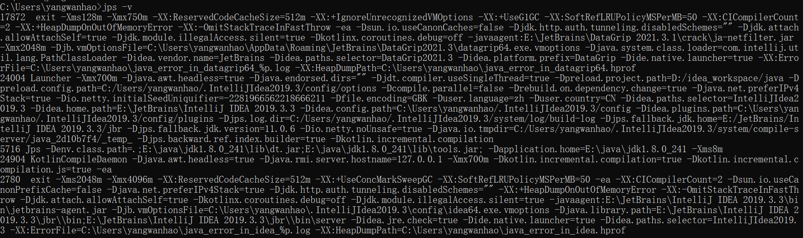
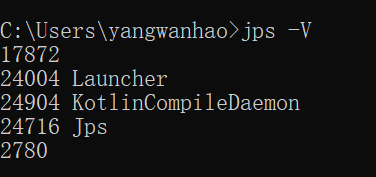
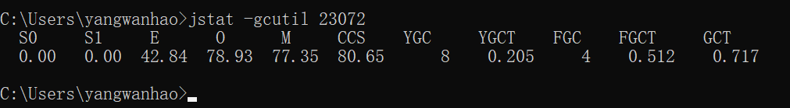
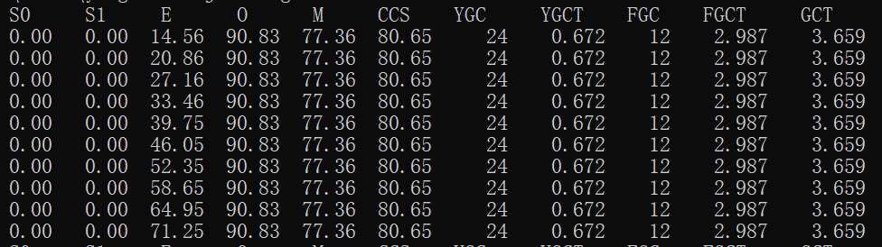
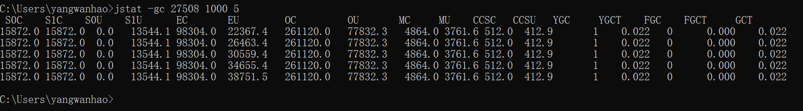
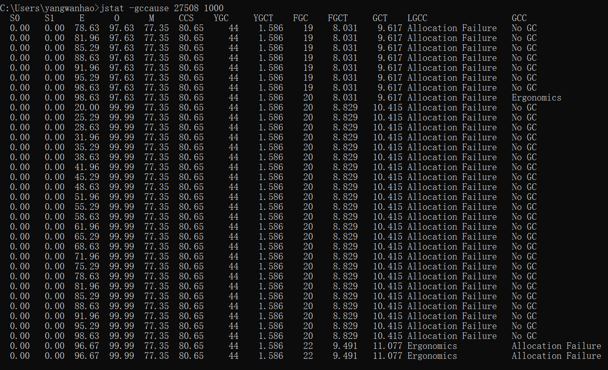
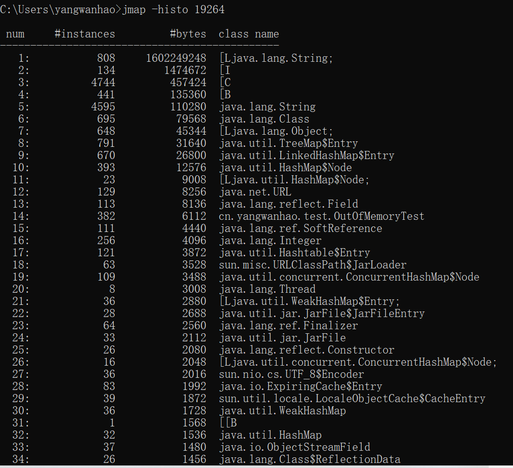
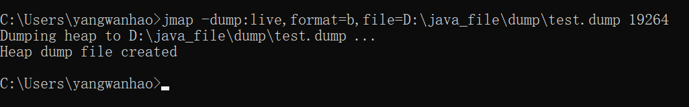
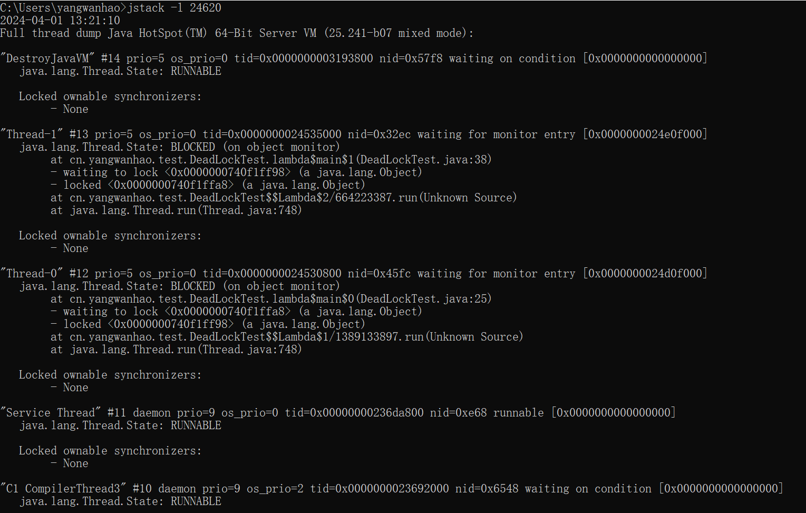

# 一、jps命令 显示当前用户下的java进程号

### 1、jps 显示进程号和主类名

### 2、jps -l 显示进程号和主类的全路径名

### 3、jps -q 只显示进程号

### 4、jps -m 显示进程号和传递给main方法的参数

### 5、jps -v 显示进程号和传递给JVM的参数

### 6、jps -V 等同于jps

# 二、jstat命令 用于查看GC的实时状况及统计信息

### 1、jstat -gcutil 进程号 -h10 间隔时间 打印次数

##### ①进程号可以用jps命令获得

##### ②间隔时间参数为整数，单位为毫秒，1000则代表1秒刷新一次，如果没有间隔时间则默认只打印1次

##### ③打印次数参数也可以没有，那么就会一直打印下去，直到进程结束或者Ctrl+C退出jstat命令

##### ④其中-h10代表每打印10次就重新打印一下标头，防止打印次数太多记不住标头对应的列

##### ⑤参数解释：对应的数字表示已用空间占总空间的百分比

###### S0和S1分别代表年轻代的Survivor的两个区；E代表年轻代的Eden区；O代表老年代；M代表元空间

###### CCS代表压缩类空间使用率(其实不是很理解)

###### YGC代表年轻代GC(*也就是MinorGC*)的次数；YGCT代表年轻代GC使用的总时间

###### FGC代表老年代GC(也就是FullGC)的次数；FGCT代表FullGC使用的总时间

###### GCT代表年轻代GC和老年代GC的总耗时，也就是YGCT和FGCT相加的和

### 2、jstat -gc 进程号 间隔时间 打印次数

##### 这个命令和上面命令的区别就是上面gcutil参数展示的是百分比，而gc参数展示的是实际的容量(单位是字节)

### 3、jstat -gccapacity 进程号 间隔时间 打印次数(参数可读性差，不常用)

### 4、jstat -gccause 进程号 间隔时间 打印次数

###### LGCC代表最后一次GC原因，GCC代表当前GC原因。

###### Allocation Failure代表年轻代分配内存失败，进而发生了一次垃圾回收(Minor GC)，但不表示这次只发生了Minor GC。

###### Ergonomics代表JVM自适应调整发生的Full GC。

# 三、jmap命令 用于生成JVM虚拟机堆转储快照dump文件

### jmap -histo 进程号 打印对象的统计

### jmap -dump:live,format=b,file=D:\java_file\dump\test.dump 进程号

##### 参数讲解：live:选中存活对象；all:选中所有对象；format=b:导出二进制格式；file=filePath:文件的存储路径

# 四、jstack命令 打印Java进程里线程的情况

### jstack -l 进程号  打印锁的相关信息

# 五、jinfo命令 用于查看JVM虚拟机的配置参数

### jinfo 选项 进程号

##### 选项解释：

###### ①如果不传任何选项，那么jinfo命令会展示所有的环境变量和JVM参数

###### ②jinfo -flags 进程号 只展示JVM参数

###### ③jinfo -sysprops 进程号 只展示环境变量

