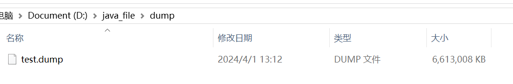

# JVM整体构成

JVM由`类加载子系统(类加载器)`、`运行时数据区(JVM内存区域)`、`执行引擎`、`本地库接口`四个部分组成。

# 类加载子系统和生命周期

1. 加载：把class文件从磁盘加载到方法区内存中
2. 链接
   1. 验证：验证class文件的格式是否正确，以`0xCAFEBABE`开头
   2. 准备：为static变量分配内存并赋零值(默认值)
   3. 解析：将符号引用解析为直接引用，把类的名字解析为类的class对象在方法区的地址
3. 初始化：给类内static属性赋值(代码中真正的值)
4. 使用：创建对象使用
5. 卸载：执行垃圾回收

# 类加载器和双亲委派机制

1. BootStrapClassLoader：启动类加载器，也是JVM内部定义的类加载器，也是所有类加载器的顶级父类，用于加载`%JAVA_HOME%/lib`路径下的class文件
2. ExtClassLoader：用于加载`%JAVA_HOME%/lib/ext`路径下的class文件
3. AppClassLoader：用于加载`Java -classpath`路径下的class文件
4. CustomClassLoader：自定义类加载器，通过继承 java.lang.ClassLoader类的方式实现

双亲委派模式，也就是加载器加载类时先把请求委托给自己的父类加载器执行，直到顶层的启动类加载器。父类加载器能够完成加载则成功返回，不能则子类加载器才自己尝试加载。

优点: 1. 避免类的重复加载 2. 避免Java的核心API被篡改。

# Tomcat为什么要打破双亲委派模型

# JVM内存模型

- 线程共享区：所有线程共享的内存区域
  - 堆：Java堆在虚拟机启动的时候被创建，Java堆主要用来为类实例对象和数组分配内存。
  - 方法区(元空间)：方法区在虚拟机启动的时候被创建，它存储了每一个类的结构信息，例如运行时常量池、字段和方法数据、构造函数和普通方法的字节码内容、还包括在类、实例、接口初始化时用到的特殊方法。方法区可能发生如下异常情况： 如果方法区的内存空间不能满足内存分配请求，那Java虚拟机将抛出一个OutOfMemoryError异常。

- 线程独占区：每个线程在这些内存区域都有自己独占的部分内存空间
  - 栈：每个Java线程都有自己的栈空间。Java虚拟机栈用来存放栈帧，而栈帧主要包括了：`局部变量表`、`操作数栈`、`动态链接`和`方法返回地址`。Java虚拟机栈允许被实现为固定大小或者可动态扩展的内存大小。如果Java虚拟机栈被实现为固定大小内存，线程请求分配的栈容量超过Java虚拟机栈允许的最大容量时，Java虚拟机将会抛出一个StackOverflowError异常。如果Java虚拟机栈被实现为动态扩展内存大小，并且扩展的动作已经尝试过，但是目前无法申请到足够的内存去完成扩展，或者在建立新的线程时没有足够的内存去创建对应的虚拟机栈，那Java虚拟机将会抛出一个OutOfMemoryError异常。
  - 本地方法栈：与栈的作用相似，只不过本地方法栈是用于调用本地方法(native方法)的栈区域。
  - 程序计数器：是一个记录着当前线程所执行的字节码的行号指示器。也是唯一一个在Java虚拟机规范中没有规定OutOfMemoryError的区域。执行Java方法时，程序计数器记录的是正在执行的字节码指令的地址，执行native本地方法时，程序计数器的值为空。

# 堆内内存分布

堆内存分布是根据所用的垃圾收集器和垃圾收集算法来做不同方式的划分的。

- 复制算法&分代收集算法：堆内存被分为新生代和老年代

  - 老年代：占堆内存的2/3空间，主要用于存放大对象和经历过数次垃圾收集之后仍然存活的对象
  - 新生代：占堆内存的1/3空间，新生代又被划分为三个部分，一个Eden区和两个Survivor区
    - Eden区：占新生代内存的8/10，主要用于存放新对象，当Eden区满了之后就开始触发Minor GC进行垃圾回收，存活的对象将被复制到其中一个Survivor区，然后清掉整个Eden区。
    - From Survivor区：占新生代内存的1/10，和Eden区一样是为了存放新对象的，但是在经历一次GC后会和To Survivor区进行一次交换。
    - To Survivor区：占新生代内存的1/10，主要用于存放GC后仍然存活的对象，但是在经历一次GC后会和From Survivor区进行一次交换。

  JVM 每次只会使用Eden区和其中的一块Survivor区域来为存放新对象，所以无论什么时候，总是有一块Survivor区域是空闲着的。因此，新生代实际可用的内存空间为9/10的新生代空间。

- G1垃圾收集器：

  G1垃圾收集器不再划分新生代和老年代，而是把堆内存区域划分为多个大小相等的独立区域(Region)，每一个Region都可以根据需要扮演新生代Eden区、新生代Survivor区或者老年代区域。收集器可以对扮演不同角色的区域使用不同的垃圾收集算法。

# 怎么判断垃圾对象

- 引用计数法：给对象添加一个引用计数器，每当一个地方引用它时，计数器就+1,；当引用失效时，计数器就-1；任何时刻计数器为0的对象是不能再被使用的，即可回收的。但是，引用计数法存在一个BUG，就是当两个在其他地方无用的对象互相引用时，那么它们的引用计数器都为1，那么他们就会永远不能被回收。

- 可达性分析法：通过一系列的被称为“GC Roots”的对象作为起始点，从这些节点开始向下搜索，搜索所走过的路径称为引用链，当一个对象到GC Roots没有任何引用链相连时(就是从GC Roots到这个对象不可达时)，则证明这个对象是不可用的，可以被回收掉。可以作为GC Roots的对象包含以下几种：

  ①虚拟机栈(栈帧中的本地变量表)中引用的对象

  ②方法区中类静态属性引用的对象

  ③方法区中常量引用的对象

  ④本地方法栈中引用的对象

# 垃圾收集算法

- 标记-清除算法：

  算法分为“标记” 和 “清除”两个阶段。首先标记出所有需要回收的对象，然后在标记完成后统一回收所有被标记的对象。缺点主要有两个：

  一个是效率问题，标记和清除两个过程的效率都不高；

  第二个是空间问题，标记清除之后会产生大量不连续的内存碎片，空间碎片太多可能会导致在程序运行过程中需要分配较大的对象时，因为无法招到足够的连续内存而不得不提前触发垃圾收集动作，如果程序中的大对象比较多，可能会导致JVM频繁的触发垃圾收集动作。

- 复制算法：

  复制算法将内存按容量划分为大小相等的两块，每次只使用其中的一块。当这一块的内存用完了，就将还存活着的对象复制 到另一块内存，然后把已使用的这块内存整体一次清理掉。这样既提高了效率，也避免了空间碎片的产生。

  但是，这样却要牺牲掉一半的内存，代价未免太高了一些。

  而且根据研究，新生代中的对象98%是朝生暮死的，所以不需要按照1:1的比例来划分内存空间。而是将内存空间划分为一块较大的Eden空间和两块较小的Survivor空间，每次使用Eden和其中的一块Survivor，当回收时，将Eden和Survivor上还存活的对象全部复制到另一块Survivor空间上，然后一次回收Eden和用过的Survivor空间。**如果经历一次GC后剩余的存活对象超过一个Survior区的容积，那么多余的对象会直接进入老年代。**HotSpot虚拟机默认Eden和Survivor空间的大小比例是8:1:1，这样就只会浪费10%的内存空间，这个代价是可以接受的。

- 标记-整理算法：

  复制算法在对象存活率较高的情况下需要进行大量的复制操作，而且如果每次回收后都有多于10%的对象存货，那么仅仅一块Survivor空间是不够用的，还需要依赖其他内存进行分配担保，这样效率就会变得很低。

  于是就有了另一种算法，就是标记-整理算法。它的标记过程与标记-清除算法一样，但是后续步骤不是直接对可回收对象直接进行回收清理，而是让所有的存活对象向一端移动，然后直接清理掉边界以外的内存。避免了空间碎片的产生，而且不需要浪费内存。

- 分代收集算法：

  当前商业虚拟机都采用的是分代收集算法。

  分代收集算法并没有新的算法思想，只是根据对象存活周期的不同将内存划分为几块。

  一般是把Java堆分为新生代和老年代，根据各个年代的特点采用最适当的垃圾收集算法。在新生代中，每次都有大量的对象死去，就选用复制算法，这样只需要付出少量存活对象的复制成本就可以完成收集和清理；而老年代中对象存活率较高且没有额外空间对它进行空间分配担保，就必须要使用标记-清理或者标记-清除算法来完成。

# 三色标记算法

三色标记算法主要是用于解决垃圾回收时Stop The World(简称STW)时间过长的问题的。STW是指在做垃圾回收时，JVM会暂停垃圾回收之外的所有工作线程，也就是说在做垃圾回收时JVM无法正常处理Java应用的请求，程序会有一段时间的停止响应，这在很多场景中是无法接受的。

三色标记算法有两个优点：

①将STW变为并发标记。STW是指在标记垃圾的时候，程序必须暂停工作；而并发标记就是指程序一边运行一边标记垃圾对象。

②避免重复扫描对象，提高标记阶段的效率。

三色标记法就是根据可达性分析，从GC Root开始遍历访问，在遍历对象过程中，根据"`是否检查过`"这个条件将对象标记为以下三种颜色：

**白色**：该对象没有被标记过，**可能**是一个垃圾对象。

**灰色**：该对象已经被标记过，但是其下属对象没有被标记过，GC需要以此对象作为GC Root节点向下寻找垃圾对象。

**黑色**：该对象及其下属对象已经全部被标记过了。

**标记过程整体如下：**

①初始时，所有对象都标记为白色

②将GC Root直接饮用的对象标记位灰色

③从灰色对象集合中获取一个对象，将该对象引用的其他全部对象标记为灰色，然后把该对象标记为黑色

④重复步骤三，知道灰色对象集合全部处理完毕

标记结束后，仍然为白色的对象则认为是GC Root不可达对象，将被垃圾回收。

**存在的问题：**

①浮动垃圾问题：并发标记的过程中，一个黑色或者灰色的对象可能会变成垃圾对象，但是由于不会再对黑色对象再次扫描，所以这个垃圾对象就不会被清除，就成为了浮动垃圾对象。但是浮动垃圾对象对系统的影响不大，因为下一次垃圾收集时就会重新从GC Root开始扫描，将其标记为白色，从而被回收掉。

②对象漏标问题：并发标记的过程中，一个已经被标记为白色的对象突然又被黑色对象引用了，但是由于不会再对黑色对象再次扫描，导致该对象被程序所需要，但是又要被垃圾回收，这就会导致系统出现问题。CMS和G1垃圾收集器在使用三色标记法的时候，都采用了一些措施来处理这两个问题。CMS对增加引用环节进行处理，G1则对删除引用环节进行处理。

# 垃圾收集器的分类

### 串行垃圾收集器：

这类垃圾收集器的主要特点是：STW，只能有一个垃圾回收线程执行，其他线程都需要暂停。

#### Serial和Serial Old

Serial是新生代垃圾收集器，采用**复制算法**，使用参数`-XX:+UseSerialGc`开启。

Serial Old是老年代垃圾收集器，采用**标记-整理算法**，使用参数`-XX:+UseSerialOldGc`开启。

它们的共同优点是简单，共同缺点是STW时间长。

### 并行垃圾收集器：

这类垃圾收集器的主要特点是：STW，多条垃圾手机线程同时执行，但是其他线程仍然都需要暂停。

#### Parallel Scavenge垃圾收集器和Parallel Old垃圾收集器

Parallel Scavenge是新生代垃圾收集器，采用**复制算法**，使用参数`-XX:+UseParallelGc`开启。

Parallel Old是老年代垃圾收集器，采用**标记-整理算法**，使用参数`-XX:+UseParalleOldGc`开启。

默认收集线程数和CPU核数相同，同时也支持使用`-XX:ParallelGCThreads`参数指定收集线程数，但是一般不推荐修改。

它们的共同优点是多线程收集，STW时间相对较短，高效利用CPU。

#### ParNew垃圾收集器

新生代采用**复制算法**，老年代采用**标记-整理算法**，使用参数`-XX:+UseParNewGC`开启。ParNew和Parallel收集器类似，区别在于ParNew可以和CMS收集器配合使用。

### 并发垃圾收集器：

这类垃圾收集器的主要特点是：垃圾收集线程和用户线程并发执行(不一定是并行执行，可能是交替执行)，但是不会STW。

#### CMS垃圾收集器：

全称是Concurrent Mark Sweep，是一种以获取最短回收时间为目标的收集器，采用**标记-清除算法**，使用参数`-XX:+UseConcMarkSweepGC(Old)`开启。

整个清理过程可以分为四步：

1. **初始标记**：暂停其他所有的线程(STW)，并记录下GC Root直接能引用的对象，速度很快。
2. **并发标记**：并发标记过程就是从GC Root的直接关联对象开始遍历整个对象图的过程，这个过程耗时较长但是不需要STW，可以与垃圾收集线程并发执行。因为用户线程继续运行，可能会导致已经标记过的对象状态发生改变。
3. **重新标记**：前面说到并发标记阶段因为用户线程继续执行会导致对象的标记发生变动，重新标记就是为了修正那部分对象的标记记录。这个阶段的停顿时间要比初始标记阶段要长，但是比并发标记阶段要短得多。主要用到三色标记里的增量更新算法做重新标记。
4. **并发清理**：开启用户线程，同时开启GC线程对未标记的区域做清理。这个阶段如果有新增对象会被标记为黑色(不处理)。
5. **并发重置**：重置本次GC过程中的标记数据。

CMS的主要优点：并发收集、低停顿。

CMS的缺点：

①会和用户线程争抢CPU资源

②无法处理浮动垃圾

③使用的标记-清除算法会产生大量空间碎片，不过可以通过使用`-XX:+UseCMSCompactAtFullCollection`参数让JVM做完标记-清除后做压缩整理。

④执行过程中存在不确定性，会存在上一次垃圾回收还没执行完，就又触发了一次垃圾回收的情况，特别是在并发标记和并发清理阶段会出现，一边回收垃圾一边系统运行，可能会出现没回收完就触发GC的情况，也就是"concurrent mode failure"，此时会进入STW，并改为用Serial Old垃圾收集器回收。

CMS的核心参数：

- -XX:+UseConcMarkSweepGC，开启CMS垃圾收集器
- -XX:ConcGCThreads，控制并发的GC线程数
- -XX:+UseCMSCompactAtFullCollection，在FullGC之后做压缩整理(减少碎片)
- -XX:CMSFullGCsBeforeCompaction，控制多少次FullGC之后压缩一次，默认是0，代表每次FullGC后都会压缩一次
- -XX:CMSInitiatingOccupancyFraction，当老年代使用达到该比例时会触发FullGC (黑默认是92，这是百分比)
- -XX:+UseCMSInitiatingOccupancyOnly，只使用设定的回收阈值(-XX:CMSInitiatingOccupancyFraction设定的值)，如果不指定，JVM仅在第一次使用设定值，后续则会自动调整
- -XX:+CMSScavengeBeforeRemark，在CMS GC前启动一次minor gc，目的在于减少老年代对年轻代的引用，降低CMS GC的标记阶段时的开销，一般CMS的GC耗时80%都在标记阶段
- -XX:+CMSParallellnitialMarkEnabled，表示在初始标记的时候多线程执行，缩短STW的时间
- -XX:+CMSParallelRemarkEnabled:在重新标记的时候多线程执行，缩短STW的时间

#### G1垃圾收集器：

G1垃圾收集器把堆内存区域划分为多个大小相等的独立区域(Region)，每一个Region都可以根据需要扮演新生代Eden区、新生代Survivor区或者老年代区域。收集器可以对扮演不同角色的区域使用不同的垃圾收集算法。

#### ~~ZGC垃圾收集器：TODO~~

# 项目中如何使用垃圾收集器

ParNew(新生代)+CMS(老年代)：适用于需要低停顿时间的应用。

# 内存泄漏和内存溢出的区别

内存溢出：是指程序尝试分配更多的内存空间，但可用的内存已经用尽了，因此无法满足分配的请求。这通常发生在程序执行期间，如创建新对象或调用时需要分配内存，但没有足够的内存可供分配。

内存泄漏：程序在申请内存后，无法释放已申请的内存空间，导致这部分内存一直被占用，无法用于其他目的。这种情况通常由于编程错误、逻辑错误或设计缺陷等原因引起。内存泄漏最终会导致内存溢出。

简而言之，内存泄漏是由于未能及时释放已经分配的内存，而内存溢出是由于分配的内存超过了系统可用的内存。

# JVM对象

## Java对象的创建过程

1. JVM遇到一条新建对象的指令时首先去检查这个指令的参数是否能在常量池中定义到一个类的符号引用，然后加载这个类。
2. 为对象分配内存。一种办法“指针碰撞”、一种办法“空闲列表”，最终常用的办法“本地线程缓冲分配(TLAB)”。
3. 将除对象头外的对象内存空间初始化为0
4. 对对象头进行必要设置

## Java的对象结构

Java对象由三个部分组成：对象头、实例数据、对齐填充。

对象头由两部分组成，第一部分存储对象自身的运行时数据：哈希码、GC分代年龄、锁标识状态、线程持有的锁、偏向线程ID(一般占32/64 bit)。第二部分是指针类型，指向对象的类元数据类型(即对象代表哪个类)。如果是数组对象，则对象头中还有一部分用来记录数组长度。

实例数据用来存储对象真正的有效信息(包括父类继承下来的和自己定义的)。

对齐填充：JVM要求对象起始地址必须是8字节的整数倍(8字节对齐)。

# JVM命令

## 一、jps命令 显示当前用户下的java进程号

### 1、jps 显示进程号和主类名

### 2、jps -l 显示进程号和主类的全路径名

### 3、jps -q 只显示进程号

### 4、jps -m 显示进程号和传递给main方法的参数

### 5、jps -v 显示进程号和传递给JVM的参数

### 6、jps -V 等同于jps

## 二、jstat命令 用于查看GC的实时状况及统计信息

### 1、jstat -gcutil 进程号 -h10 间隔时间 打印次数

##### ①进程号可以用jps命令获得

##### ②间隔时间参数为整数，单位为毫秒，1000则代表1秒刷新一次，如果没有间隔时间则默认只打印1次

##### ③打印次数参数也可以没有，那么就会一直打印下去，直到进程结束或者Ctrl+C退出jstat命令

##### ④其中-h10代表每打印10次就重新打印一下标头，防止打印次数太多记不住标头对应的列

##### ⑤参数解释：对应的数字表示已用空间占总空间的百分比

###### S0和S1分别代表年轻代的Survivor的两个区；E代表年轻代的Eden区；O代表老年代；M代表元空间

###### CCS代表压缩类空间使用率(其实不是很理解)

###### YGC代表年轻代GC(*也就是MinorGC*)的次数；YGCT代表年轻代GC使用的总时间

###### FGC代表老年代GC(也就是FullGC)的次数；FGCT代表FullGC使用的总时间

###### GCT代表年轻代GC和老年代GC的总耗时，也就是YGCT和FGCT相加的和

### 2、jstat -gc 进程号 间隔时间 打印次数

##### 这个命令和上面命令的区别就是上面gcutil参数展示的是百分比，而gc参数展示的是实际的容量(单位是字节)

### 3、jstat -gccapacity 进程号 间隔时间 打印次数(参数可读性差，不常用)

### 4、jstat -gccause 进程号 间隔时间 打印次数

###### LGCC代表最后一次GC原因，GCC代表当前GC原因。

###### Allocation Failure代表年轻代分配内存失败，进而发生了一次垃圾回收(Minor GC)，但不表示这次只发生了Minor GC。

###### Ergonomics代表JVM自适应调整发生的Full GC。

## 三、jmap命令 用于生成JVM虚拟机堆转储快照dump文件

### jmap -histo 进程号 打印对象的统计

### jmap -dump:live,format=b,file=D:\java_file\dump\test.dump 进程号

##### 参数讲解：live:选中存活对象；all:选中所有对象；format=b:导出二进制格式；file=filePath:文件的存储路径

## 四、jstack命令 打印Java进程里线程的情况

### jstack -l 进程号  打印锁的相关信息

## 五、jinfo命令 用于查看JVM虚拟机的配置参数

### jinfo 选项 进程号

##### 选项解释：

###### ①如果不传任何选项，那么jinfo命令会展示所有的环境变量和JVM参数

###### ②jinfo -flags 进程号 只展示JVM参数

###### ③jinfo -sysprops 进程号 只展示环境变量

## 六、启动命令参数

| 参数                      | 说明                                                         |
| ------------------------- | ------------------------------------------------------------ |
| -Xms1024m                 | 设置 JVM 启动时的初始堆内存大小，也就是堆内存最小值，为1024M |
| -Xmx2048m                 | 设置 JVM 堆内存的最大可用空间，也就是堆内存最大值，为2048M   |
| -Xmn256m                  | 对`-XX:NewSize`和`-XX:MaxNewSize`同时配置进行                |
| -XX:NewSize=300m          | 新生代初始化内存大小，注意该值要小于-Xms的值                 |
| -XX:MaxNewSize=1024m      | 新生代可被分配的最大内存上限，注意该值要小于-Xmx的值         |
| -XX:MetaspaceSize=128m    | 元空间的初始大小，也就是最小值                               |
| -XX:MaxMetaspaceSize=128m | 元空间的最大大小，也就是最大值                               |
| -Xss1m                    | 设置栈内存的大小，设置的栈的大小决定了函数调用的最大深度     |
|                           |                                                              |
|                           |                                                              |