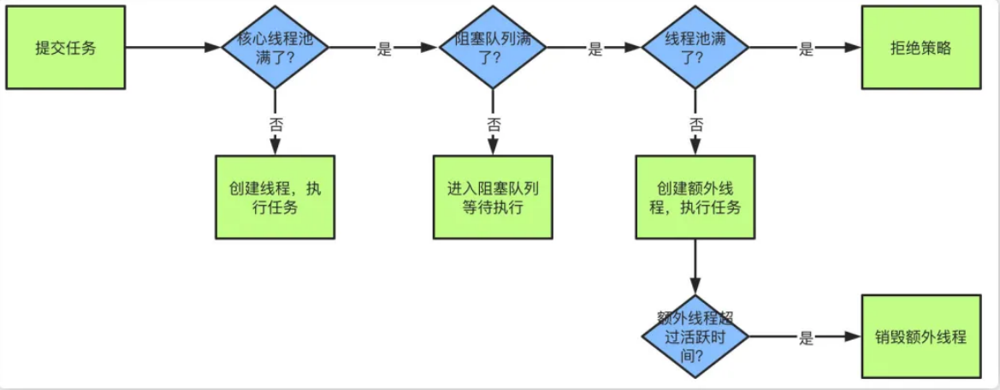

# 一、线程基础知识点

## 创建线程的几种方式

1. 继承Thread类：重写run()方法，调用start()方法启动线程。

   ```java
   public class ThreadTest extends Thread {
       
       @Override
       public void run() {
           System.out.println("重写run()方法");
       }
       
       public static void main(String[] args) {
           ThreadTest thread = new ThreadTest();
           thread.start();
       }
   }
   ```

   ```java
   public class ThreadTest {
       
       public static void main(String[] args) {
           new Thread(() -> {
               System.out.println("重写run()方法");
           }).start();
       }
   }
   ```

2. 实现Runnable接口：重写run()方法，然后将Runnable的对象实例交给Thread的构造器，由Thread调用start()方法启动线程。

   ```java
   public class ThreadTest implements Runnable {
   
       public static void main(String[] args) {
           ThreadTest runnable = new ThreadTest();
           Thread thread = new Thread(runnable);
           thread.start();
       }
   
       @Override
       public void run() {
           System.out.println("重写run()方法");
       }
   }
   ```

3. 实现`Callable`接口：重写`call()`方法，将`Callable`对象实例交给`FutureTask`的构造器，再将`FutureTask`对象实例交给Thread的构造器，由Thread调用start()方法启动线程。

   ```java
   public class ThreadTest implements Callable<String> {
   
       public static void main(String[] args) throws ExecutionException, InterruptedException {
           ThreadTest callableThread = new ThreadTest();
           FutureTask<String> futureTask = new FutureTask<>(callableThread);
           Thread thread = new Thread(futureTask);
           thread.start();
           // get()在线程运行完成并获取到结果之前会一直阻塞
           // get()获取到call()的返回值
           String string = futureTask.get();
           // 这里就会输出hello world
           System.out.println(string);
       }
   
       @Override
       public String call() throws Exception {
           System.out.println("重写call()方法");
           return "hello world";
       }
   }
   ```

4. 线程池：------暂不演示

总结：

继承Thread类的方式编码和使用都更简单快捷，但是由于Java是单继承的机制，一旦继承了Thread类就不能再继承其他类。

实现Runnable接口或者Callable接口的方式可以避免单继承的问题，而且这种方式下，多个线程可以共享同一个target对象，所以非常适合多个相同线程来处理同一份资源的情况，但是编码相对复杂一些。

Callable接口还可以通过FutureTask的get()方法接收call()方法的返回值，对于需要接收线程执行结果的情况更适合使用。

## Thread类的run方法和start方法的区别

start方法是开启一个新的线程，在新的线程里调用run方法。

直接调用run方法则是在原来的线程里执行run方法，没有开启新的线程。

## 线程有哪些状态

1. **NEW**：当一个Thread对象被new出来后，但是还没有调用start方法的时候。

   ```java
   public class ThreadTest {
       public static void main(String[] args) {
           Thread thread = new Thread();
           // 这里的输出结果就会是NEW
           System.out.println(thread.getState());
       }
   }
   ```

2. **RUNNABLE**：当一个Thread对象被调用start方法后，就会进入RUNNABLE状态。此时线程并未真正执行，需要和其他线程竞争CPU资源，当该线程竞争到了CPU资源，才会真正执行。

   ```java
   public class ThreadTest {
       public static void main(String[] args) {
           Thread thread = new Thread();
           thread.start();
           // 这里的输出结果就会是RUNNABLE
           System.out.println(thread.getState());
       }
   }
   ```

3. **BLOCKED**：线程被阻塞，如果它正在等待监视器锁，即在其他线程持有锁的情况下，它将无法执行，直到获取锁。

   ```java
   public class ThreadTest {
   	// 下面演示一段死锁的代码
       public static void main(String[] args) throws InterruptedException {
           
           Object o1 = new Object();
           Object o2 = new Object();
           // 第一个线程先锁住o1然后休眠1秒钟再尝试锁住o2
           Thread thread1 = new Thread(() -> {
               synchronized (o1) {
                   try {
                       Thread.sleep(1000);
                   } catch (InterruptedException e) {
                       e.printStackTrace();
                   }
                   synchronized (o2) {
                   }
               }
           });
           // 第二个线程先锁住o2然后直接尝试锁住o1
           Thread thread2 = new Thread(() -> {
               synchronized (o2) {              
                   synchronized (o1) {
                   }
               }
           });
   		// 启动两个线程，然后休眠1500秒，让两个线程都进入死锁状态
           thread1.start();
           thread2.start();
           Thread.sleep(1500);
           // 这里输出的状态都是BLOCKED，而且由于死锁程序不会结束，而是一直运行下去尝试获取锁
           System.out.println(thread1.getState());
           System.out.println(thread2.getState());
       }
   }
   ```

4. **WAITING**：无期限等待，处于这种状态的线程不会被CPU分配资源，需要被其他线程显式的唤醒才能继续执行。

   ```java
   public class ThreadTest {
       public static void main(String[] args) throws InterruptedException {
           Object o = new Object();
           Thread currentThread = Thread.currentThread();
           new Thread(() -> {
               synchronized (o) {
                   // 这里的输出结果就会是WAITING
                   System.out.println(currentThread.getState());
               }
           }).start();
           synchronized (o) {
               o.wait();
           }
       }
   }
   ```

5. **TIMED_WAITING**：有期限等待，处于这种状态的线程也不会被CPU分配资源，但是它们可以在规定的时间结束后被系统自动唤醒。

   ```java
   public class ThreadTest {
       public static void main(String[] args) throws InterruptedException {
           Object o = new Object();
           Thread currentThread = Thread.currentThread();
           new Thread(() -> {
               synchronized (o) {
                   // 这里的输出结果就会是TIMED_WAITING
                   System.out.println(currentThread.getState());
               }
           }).start();
           synchronized (o) {
               // 注意这里的wait方法传入了一个时间参数
               o.wait(5000);
           }
       }
   }
   ```

   ```java
   public class ThreadTest {
       public static void main(String[] args) throws InterruptedException {
           Object o = new Object();
           Thread currentThread = Thread.currentThread();
           new Thread(() -> {
               synchronized (o) {
                   // 这里的输出结果就会是TIMED_WAITING
                   System.out.println(currentThread.getState());
               }
           }).start();
           // 使用Thread.sleep也可以到达这种状态
           Thread.sleep(5000);
       }
   }
   ```

6. **TERMINATED**：当线程完成执行或被中断，它就进入死亡状态。

   ```java
   public class ThreadTest {
       public static void main(String[] args) throws InterruptedException {
           Thread thread = new Thread();
           thread.start();
           // 这里休眠的是主线程，也就是main方法所在的线程，而不是上面被new出来的thread
           // 休眠是为了能够让thread执行完成
           Thread.sleep(1000);
           // 这里的输出结果就会是TERMINATED
           System.out.println(thread.getState());
       }
   }
   ```

## 如何停止一个正在运行的线程

1. run()方法正常执行完成后自动结束运行。

2. 使用Thread类的stop()方法强制终止线程，但是不推荐这样，因为stop()方法已经在JDK1.2版本就废弃了。

   以下代码演示来了一个死循环的输出线程，以及使用stop方法强制终止线程的的实例。这里的死循环输出会在调用stop方法后停止。

   ```java
   public class ThreadTest {
   
       public static void main(String[] args) throws InterruptedException {
           Thread thread = new Thread(() -> {
               while (true) {
                   System.out.println("Thread is running");
               }
           });
           thread.start();
           Thread.sleep(1000);
           thread.stop();
       }
   }
   ```

3. 使用Thread类的interrupt()方法尝试中断线程。

   以下代码演示来了一个死循环的输出线程，以及使用interrupt方法尝试终止线程的的实例。

   但是，这里的thread线程并不能够真的被终止，通过代码执行可以发现控制台一直在输出，所以线程其实并没有被真正停止。interrupt()方法不是真的去中断线程的执行，而是给线程设置了一个中断标志，是否中断还是由线程自己进行判断。

   ```java
   public class ThreadTest {
   
       public static void main(String[] args) throws InterruptedException {
           Thread thread = new Thread(() -> {
               while (true) {
                   // 运行后可以发现，这句输出一直在执行，说明线程没有被真正终止
                   System.out.println("Thread is running");
               }
           });
           thread.start();
           Thread.sleep(1000);
           // 执行interrupt()方法，设置中断标记true，但是不会真的结束线程
           thread.interrupt();
       }
   }
   ```

## interrupt()、interrupted()和isInterrupted()

1. interrupt()：是中断线程的方法，它会给线程设置一个中断标记true，但是是否中断还是由线程自己去判断。

2. isInterrupted()：查询当前线程的中断标记位，返回值boolean类型，而且不会修改中断标记。

   以下代码实例，会在输出几句"Thread is running"后因为查询到中断标记为true而退出循环，程序运行结束。

   ```java
   public class ThreadTest {
   
       public static void main(String[] args) throws InterruptedException {
           Thread thread = new Thread(() -> {
               while (true) {
                   System.out.println("Thread is running");
                   // 判断如果线程的中断标志为true，就结束循环，线程也会执行结束
                   if (Thread.currentThread().isInterrupted()) {
                       break;
                   }
               }
           });
           thread.start();
           Thread.sleep(1000);
           // 执行interrupt()方法，设置中断标记true，但是不会真的结束线程
           thread.interrupt();
       }
   }
   ```

3. interrupted()：**是Thread类的静态方法**。和isInterrupted()的功能相似，它也是一个查询当前线程的中断标记的方法，返回值boolean类型，**但是它在查询中断标记后会把当前线程的中断标记置为false**！

   以下代码演示了一个demo，在主线程执行interrupt()方法，给子线程设置中断标记true，在子线程的run()方法里，会先使用Thread.interrupted()查询中断标记，如果为true则输出一下，然后再使用isInterrupted()判断中断标记，如果为true则结束循环。由于Thread.interrupted()虽然会有一次查询到中断标记为true，但是查询后该方法又会把中断标记置为false，所以下边的isInterrupted()拿到的结果其实永远是false，所以这段代码会输出一句true然后又一直死循环运行。

   ```java
   public class ThreadTest {
   
       public static void main(String[] args) throws InterruptedException {
           Thread thread = new Thread(() -> {
               while (true) {
                   // 使用interrupted()方法查询中断标记，同时把中断标记置为false
                   boolean interrupted = Thread.interrupted();
                   if (interrupted) {
                       // 因为下边执行了interrupt()方法，设置中断标记true，这里进入一次，输出true
                       System.out.println(interrupted);
                   }
                   // 因为interrupted()方法查询中断标记后把中断标记置为false，所以这里又不会进入了
                   if (Thread.currentThread().isInterrupted()) {
                       break;
                   }
               }
           });
           thread.start();
           Thread.sleep(1000);
           // 执行interrupt()方法，设置中断标记true，但是不会真的结束线程
           thread.interrupt();
       }
   }
   ```

## Thread类的yield()方法

yield()方法可以暂停当前正在执行的线程对象，让其它有相同优先级的线程执行。它是**一个静态方法**，而且只保证当前线程放弃CPU占用而不能保证使其它线程一定能占用CPU，执行yield()的线程有可能在进入到暂停状态后马上又被执行。执行yield()方法后线程的状态还是RUNNABLE。

## Thread类的join()方法

join()方法可以使一个线程插队并抢夺CPU资源，被插队的线程只能等插队的线程执行完成后才能执行。

以下代码demo演示了一个案例，案例要求给定三个Thread，要求按照thread1,thread2,thread3的顺序保证顺序执行输出。

```java
public class ThreadTest {

    public static void main(String[] args) {
        /*
         * 要求：给定三个Thread，要求按照thread1,thread2,thread3的顺序保证顺序执行输出
         */
        Thread thread1 = new Thread(() -> {
            System.out.println("thread1执行成功");
        }, "thread1");

        Thread thread2 = new Thread(() -> {
            try {
                // 执行thread2时，要求thread1插队在thread2前边，thread2只能等thread1执行完成
                thread1.join();
            } catch (InterruptedException e) {
                e.printStackTrace();
            }
            System.out.println("thread2执行成功");
        }, "thread2");

        Thread thread3 = new Thread(() -> {
            try {
                // 执行thread3时，要求thread2插队在thread3前边，thread3只能等thread2执行完成
                thread2.join();
            } catch (InterruptedException e) {
                e.printStackTrace();
            }
            System.out.println("thread3执行成功");
        }, "thread3");

        // 这里的启动顺序可以乱序，不影响执行结果
        thread1.start();
        thread2.start();
        thread3.start();
    }
}
```

## notify()和notifyAll()方法的区别

notify()和notifyAll()都是Object类里的方法。

notify()用来唤醒在该对象的监视器上等待的单个线程。如果有多个线程都在该对象上等待，也只会唤醒一个线程，而唤醒规则取决于JVM的实现，HotSpot的虚拟机实现的效果是按照线程的休眠顺序依次唤醒。

notifyAll()会唤醒在该对象监视器上等待的所有线程，所有被唤醒的线程将会进入锁池竞争对象锁，一旦某个线程获取了对象锁，它就可以继续执行。

两者的区别：

1. 唤醒线程数量不同
   - `notify()` 只唤醒一个等待线程。
   - `notifyAll()` 唤醒所有等待线程。
2.  使用场景不同
   - `notify()` 适用于确信只有一个线程等待条件变量或者不关心哪个线程被唤醒的情况。
   - `notifyAll()` 适用于所有等待线程都必须得到通知的情况，例如，多个线程等待不同的条件变量，而这些条件变量可能同时成立。
3. 潜在的资源竞争
   - `notify()` 可能会减少资源竞争，因为它只唤醒一个线程。
   - `notifyAll()` 可能导致较高的资源竞争，因为它唤醒所有等待线程，它们将竞争锁。
4. 关于死锁
   1. `notify()` 可能会导致死锁
   2. `notifyAll()` 基本不会导致死锁

## 为什么wait()、notify()、notifyAll()方法在Object类里

因为Java提供的锁是对象级的而不是线程级的，每个对象都有锁，通过线程获得。由于wait()、notify()、notifyAll()都是锁级别的操作，所以把它们定义在Object类里。

## Java线程的优先级

线程的优先级是定义在Thread类里的priority属性，最小值是1，最大值是10，默认值则是5。

```java
	// The minimum priority that a thread can have.
    public final static int MIN_PRIORITY = 1;
   	// The default priority that is assigned to a thread.
    public final static int NORM_PRIORITY = 5;
    //The maximum priority that a thread can have.
    public final static int MAX_PRIORITY = 10;
```

## sleep()和wait()方法的区别

1. 所属类不同：sleep()方法是属于Thread类的，wait()方法是Object类的方法。
2. 方法类型不同：sleep()方法是静态方法，wait()方法是实例方法。
3. 使用方式不同：sleep()方法可以在任意地方使用Thread.sleep(long millions)来执行；wait()方法则要求对象使用synchronized必须先拿到锁才能执行，否则会抛出java.lang.IllegalMonitorStateException异常。
4. 唤醒方式不同：sleep()方法必须要传入一个时间，该线程会在指定的时间内暂停执行，让出CPU给其他线程，但是依然保持监控状态，当指定的时间到了又会自动恢复运行状态。而wait()方法可以传入一个时间，也可以不传任何参数，如果传入时间也可以在指定时间到了后自动恢复运行，如果没有传入时间则只能通过notify()或者notifyAll()方法唤醒。
5. 释放锁资源不同：在调用sleep()方法的过程中，线程不会释放对象锁。wait()方法会让线程会放弃对象锁，进入等待此对象的等待锁定池，只有针对此对象调用 notify()方法后本线程才进入对象锁定池准备，获取对象锁进入运行状态。
6. 线程状态不同：sleep()方法会让线程进入TIMED_WAITING状态；wait()如果有时间参数也会进入TIMED_WAITING状态，没有时间参数则会进入WAITING状态。

## 对象锁和类锁

- 对象锁：使用任意类型的对象作为同步代码块/同步方法的监视器

  ```java
  public class ThreadTest {
  
      public static void main(String[] args) {
          Object lockObject = new Object();
          synchronized (lockObject) {
              // do something
          }
      }
  }
  ```

- 类锁：使用类的字节码对象作为同步代码块/同步方法的监视器

  ```java
  public class ThreadTest {
  
      public static void main(String[] args) {
          synchronized (ThreadTest.class) {
              // do something
          }
      }
  }
  ```

  上面演示的是同步代码块对应的对象锁和类锁的实例。下面说明一下同步方法使用的是什么锁。

  同步方法分为普通方法和静态方法。
  
  普通方法需要由对象调用，那么锁的就是调用这个方法的this对象。
  
  ```java
  public class ThreadTest {
  	
      public static void main(String[] args) {
          ThreadTest threadTest = new ThreadTest();
          // 调用run方法时，锁的就是threadTest这个对象
          threadTest.run();
      }
  	// 加了synchronized的普通方法
      public synchronized void run() {
      }
  }
  ```
  
  静态方法可以通过类名.方法名调用，那么锁的就是这个方法所在类的字节码对象。
  
  ```java
  public class ThreadTest {
  
      public static void main(String[] args) {
          // 调用run方法时，锁的就是ThreadTest.class这个字节码对象
          ThreadTest.run();
      }
  	// 加了synchronized的静态普通方法
      public static synchronized void run() {
  
      }
  }
  ```

## synchronized和ReentrantLock的区别

两者的共同点：

- 都是可重入锁，同一线程可以多次获取锁。
- 都保证了可见性和互斥性。

两者的区别：

- synchronized是java中的关键字，是原生语法层面的互斥，需要jvm实现；ReentrantLock是JDK1.5之后实现了Lock接口的API层面的互斥锁。
- synchronized加锁和释放锁由JVM自行完成；ReentrantLock需要lock()和unlock()方法配合try&finally语句块来完成加锁和释放锁。
- synchronized只能实现非公平锁；ReentrantLock可以根据构造方法传入的参数实现公平锁和非公平锁，默认无参够造方法创建的是非公平锁。
- 在代码块发生异常时，synchronized会自动释放所持有的锁；ReentrantLock如果没有对应的finally代码块执行unlock()方法，就不会释放锁，很有可能造成死锁的情况。
- 使用synchronized时，等待的线程会一直等待，无法响应中断；而ReentrantLock可以通过调用lockInterruptibly()方法中断等待的线程。
- 使用synchronized时，如果竞争比较激烈，会存在锁升级的行为，升级为重量级锁；而ReentrantLock不会存在锁升级的情况。
- synchronized是基于ObjectMonitor实现的；ReentrantLock是基于AQS实现的。

## synchronized锁升级的过程

1. 无锁：也就是new出一个对象，并且不使用synchronized对其加锁，就是无锁。
2. 偏向锁：使用synchronized锁住一个对象且此时只有一个线程访问该对象，这就是偏向锁。偏向锁在被锁对象的对象头记录一下当前获取到该锁的线程ID，该线程下次如果又来获取锁就可以直接获取到，也就是支持锁的重入。
3. 轻量级锁：当两个及以上的线程在**交替**获取一把锁的时候，但没有在对象上并发的获取锁时，偏向锁就会升级为轻量级锁。在这个时候，线程采用CAS的自旋方式尝试获取锁，避免阻塞线程。
4. 重量级锁：当两个及以上的线程在**并发**获取一把锁的时候，为了避免无用的自旋，轻量级锁就会升级为重量级锁。

## Thread、ThreadLocal和ThreadLocalMap

以下代码简略的摘出了Thread和ThreadLocal类的一些关键的属性和方法。

```java
public class Thread implements Runnable {
    // Thread类里定义了一个`threadLocals`的属性，类型为ThreadLocal.ThreadLocalMap。
    // threadLocals属性实例化是在ThreadLocal类的createMap()方法
    ThreadLocal.ThreadLocalMap threadLocals = null;
}
```

由此可见，ThreadLocalMap类是ThreadLocal类里的一个静态内部类。

```java
public class ThreadLocal<T> {
    
    void createMap(Thread t, T firstValue) {
        // 每一个线程里的threadLocals对象都是new出来的，，所以每个线程都有各自的ThreadLocalMap
        // 创建一个ThreadLocalMap对象并向内放入一个值，key为ThreadLocal对象
        t.threadLocals = new ThreadLocalMap(this, firstValue);
    }
    
    ThreadLocalMap getMap(Thread t) {
        return t.threadLocals;
    }
   
    public T get() {
        // 获取当前线程
        Thread t = Thread.currentThread();
        // 看上边getMap代码，其实就是获取线程对象t的threadLocals属性
        ThreadLocalMap map = getMap(t);
        if (map != null) {
            // 这里的this指的就是ThreadLocal对象
            ThreadLocalMap.Entry e = map.getEntry(this);
            if (e != null) {
                T result = (T)e.value;
                return result;
            }
        }
        return setInitialValue();
    }   

    public void set(T value) {
        Thread t = Thread.currentThread();
        /**
         * 当需要向ThreadLocal中放入一个值的时候，map其实是Thread类中的threadLocals属性
         * 这也就保证了每个线程都有自己的ThreadLocalMap，线程之间的数据是隔离的
         */
        ThreadLocalMap map = getMap(t);
        if (map != null)
            // 这里可以看出，这个map的key其实是ThreadLocal的对象，value为传入的值。
            map.set(this, value);
        else
            createMap(t, value);
    }

    /** ThreadLocal的静态内部类ThreadLocalMap */
    static class ThreadLocalMap {

        /** 
         * 这里的静态内部类Entry继承了弱引用，方便垃圾回收
         * 但是注意，这里会被回收的是key，也就是ThreadLocal对象；value不会被回收删除
         * 因此，使用完成后，最好使用threadLocal.remove()回收内存
         */
        static class Entry extends WeakReference<ThreadLocal<?>> {           
        
        }     
    }
}
```


简单一点说就是：一个Thread中只有一个ThreadLocalMap，一个ThreadLocalMap中可以有多个ThreadLocal对象，其中一个ThreadLocal对象对应一个ThreadLocalMap中的一个Entry（也就是说：一个Thread可以依附有多个ThreadLocal对象）。

## 同一线程调用两次start方法会怎样

会抛出IllegalThreadStateException异常。


## 产⽣死锁的四个必要条件

- 互斥条件：同一资源同一时间内只能被一个线程持有
- 占有且等待：线程持有资源后在等待其他资源时不会释放已持有的资源
- 不可抢占：资源一旦被线程持有，不可以再被其他线程抢夺
- 循环等待：多个线程互相持有对方需要的资源且等待对方已持有的资源

## 怎么检测一个线程是否持有对象监视器

Thread类提供了一个holdsLock(Object obj)方法，当且仅当对象obj的监视器被某条线程持有的时候才会返回 true，注意这是一个static方法，这意味着"某条线程"指的是当前线程。

```java
public class Test {

    public static void main(String[] args) {
        Object o = new Object();
        // false
        System.out.println(Thread.holdsLock(o));
        synchronized (o) {
	        // true
            System.out.println(Thread.holdsLock(o));
        }
    }
}
```

## 一个线程如果出现了运行时异常会怎么样

如果这个异常没有被捕获的话，这个线程就停止执行了。

另外重要的一点是：如果这个线程持有某个某个对象的监视器，那么这个对象监视器会被立即释放。

# 二、线程池知识点

## 为什么要使用线程池

- 降低资源消耗。通过重复利用已创建的线程降低线程创建和销毁造成的消耗。
- 提高响应速度。当任务到达时，任务可以不需要等到线程创建就能立即执行。
- 提高线程的可管理性。线程是稀缺资源，如果无限制的创建，不仅会消耗系统资源，还会降低系统的稳定性，使用线程池可以进行统一的分配，调优和监控。

## Java中常用的几种线程池

- new ThreadPoolExecutor()：直接新建线程池。
- Executors.newFixedThreadPool()：创建固定大小的线程池，每次提交一个任务就创建一个线程，直到线程达到线程池的最大大小。
- Executors.newSingleThreadExecutor()：创建一个单线程的线程池，此线程池保证所有任务的执行顺序按照任务的提交顺序执行。
- Executors.newCachedThreadPool()：创建一个可缓存的线程池，此线程池不会对线程池大小做限制，线 程池大小完全依赖于操作系统(或者说JVM)能够创建的最大线程大小。
- Executors.newScheduledThreadPool()：创建一个大小无限的线程池，此线程池支持定时以及周期性执行任务的需求。
- Executors.newSingleThreadScheduledExecutor()：创建一个单线程的线程池。此线程池支持定时以及周期性执行任务的需求。
- Executors.newWorkStealingPool()：创建一个使用所有可用处理器作为其目标并行级别的工作窃取线程池。

## Java线程池的核心参数

- 核心线程数corePoolSize：也就是核心线程的数量，这些线程创建后不会销毁，而是一种常驻线程。如果线程池中的当前核心线程数小于corePoolSize，即时此时线程池中已有的核心线程在空闲，新提交的任务也会创建一个新的核心线程来执行。
- 最大线程数maximumPoolSize：如果任务较多，将核心线程消耗完了，且等待队列也已经放满了，还无法满足需求，就会创建新的非核心线程来工作，但是线程池内线程总数不会超过最大线程数。
- 活跃时间keepAliveTime、unit：非核心线程在执行完任务且空闲一定时间后就会被销毁，可以通过这两个字段来控制这个空闲时间。
- 等待队列workQueue：核心线程消耗完了后，新的任务不会立刻创建非核心线程，而是先放入等待队列中，如果等待队列也满了才会创建非核心线程。一般有以下几种等待队列：
  - `ArrayBlockingQueue`：是一个基于数组结构的有界阻塞队列，此队列按 FIFO(先进先出)原则对元素进行排序。
  - `LinkedBlockingQueue`：一个基于链表结构的阻塞队列，此队列按FIFO(先进先出)排序元 素，吞吐量通常要高于ArrayBlockingQueue。
  - `SynchronousQueue`：一个不存储元素的阻塞队列。
  - `PriorityBlockingQueue`：一个具有优先级的无限阻塞队列。 PriorityBlockingQueue 也是基于最小二叉堆实现。
  - `DelayQueue`：DelayQueue 是一个没有大小限制的队列，只有当其指定的延迟时间到了，才能够从队列中获取到该元素。
- ThreadFactory：线程工厂，用来生产线程执行任务。我们可以使用默认的线程工厂，产生的线程都在同一个组内，拥有相同的优先级，而且都不是守护线程。也可以根据实际情况选择自定义线程工厂。
- 拒绝策略RejectedExecutionHandler：一般有两种使用情况，一是线程池内的线程总数已经超过了最大线程数，这个时候新提交的任务就会直接执行拒绝策略；二是线程池已经关闭了，这个时候线程池内部还有正在执行的线程，线程池虽然还在运行但是已经开始拒绝新提交的任务了。一般有四种拒绝策略：
  - AbortPolicy：直接丢弃任务，抛出异常，这是**默认策略**
  - CallerRunsPolicy：只用调用者所在的线程来处理任务
  - DiscardOldestPolicy：丢弃等待队列中最旧的任务，并执行当前任务
  - DiscardPolicy：直接丢弃任务，也不抛出异常

## Java线程池工作流程



1. 当我们提交任务，线程池会根据corePoolSize大小创建若干任务数量线程执行任务
2. 当任务的数量超过corePoolSize数量，后续的任务将会进入阻塞队列阻塞排队
3. 当阻塞队列也满了之后，那么将会继续创建(maximumPoolSize-corePoolSize)个数量的线程来 执行任务，如果任务处理完成，maximumPoolSize-corePoolSize额外创建的线程等待 keepAliveTime之后被自动销毁
4. 如果达到maximumPoolSize，阻塞队列还是满的状态，那么将根据不同的拒绝策略对应处理

## 线程池都有哪些状态

- RUNNING：这是最正常的状态，接受新的任务，处理等待队列中的任务。
- SHUTDOWN：不接受新的任务提交，但是会继续处理等待队列中的任务。
- STOP：不接受新的任务提交，不再处理等待队列中的任务，中断正在执行任务的线程。
- TIDYING：所有的任务都销毁了，workCount 为 0，线程池的状态在转换为 TIDYING 状态时，会执行 钩子方法 terminated()。
- TERMINATED：terminated()方法结束后，线程池的状态就会变成这个。

## 线程池线程复用原理

线程池将线程和任务进行解耦，摆脱了像new Thread()这种一个线程必须对应一个任务的限制。

在线程池中，同一个线程可以不断的从workQueue中获取任务来执行，其核心原理在于线程池对Thread进行了封装，并不会每次执行任务都调用Thread.start()来创建线程，而是让每个线程去执行一个循环任务，在这个循环任务中不停的检查是否有任务需要被执行，如果有则直接执行，也就是调用任务的run()方法，这里是将run()方法当做普通方法来执行了。

## Java线程池中submit() 和 execute()方法有什么区别

返回值类型：execute()方法的返回类型是void，而submit()方法可以返回持有计算结果的Future对象。

所属接口不同：execute()方法定义在Executor接口中,而submit()方法定义在ExecutorService接口中。

## 如果线程池中的⼀个线程运⾏时出现了异常，会发⽣什么

如果提交任务的时候使用了submit()，则返回的Feature⾥会存有异常信息；

如果是execute()则会打印出异常栈，但是不会给其他线程造成影响，之后线程池会删除该线程，会新增加⼀个worker。

# 三、原子操作相关知识点

## 什么是 CAS

Compare And Swap，也就是比较和交换，它是一条CPU的并发原语。

它在替换内存中的一个值的时候，会先查看内存中的值是否与预期值一致，如果一致才进行替换操作；如果不一致则不替换。Java中基于`sun.misc.Unsafe`类实现了对CAS的操作方法，在这个类的方法里，JVM会帮我们实现CAS的汇编指令。可以看到，这个类的大部分方法都是native的。

```java
public final class Unsafe {
    public final native boolean compareAndSwapInt(Object var1, long var2, int var4, int var5);
    // ......省略了大部分的代码，基本上都是native方法，这里重点以int类型相关方法举例
    public native int getInt(Object var1, long var2);
    public native void putInt(Object var1, long var2, int var4);   	

    public final int getAndAddInt(Object var1, long var2, int var4) {
        int var5;
        do {
            var5 = this.getIntVolatile(var1, var2);
        } while(!this.compareAndSwapInt(var1, var2, var5, var5 + var4));

        return var5;
    }

    public final int getAndSetInt(Object var1, long var2, int var4) {
        int var5;
        do {
            var5 = this.getIntVolatile(var1, var2);
        } while(!this.compareAndSwapInt(var1, var2, var5, var4));

        return var5;
    }
}
```

CAS的优点：线程不会挂起，避免了用户态和内核态的切换。

CAS的缺点：

​	CAS只能保证对一个变量的操作是原子性的，无法对多个操作实现原子性。

​	CAS内部使用do-while循环一直尝试执行CAS操作，所以会造成CPU资源的消耗。

CAS的问题：ABA问题：假设有三个线程，线程一将主内存变量str的值从A改为B；线程二把str的值从B改为A；线程三把值从A改为B，虽然经过线程一和线程二的操作后线程三的期望值是正确的，但是变量str其实已经被修改过了，这是不符合原子性的。

## 基本类型原子操作类

#### AtomicInteger

以下简略的摘要了该类的部分常用方法，可以看到主要实现都是借助于Unsafe类的native方法实现的。

```java
public class AtomicInteger extends Number implements java.io.Serializable {
    
    private static final Unsafe unsafe = Unsafe.getUnsafe();
    private volatile int value;

    public final int getAndSet(int newValue) {
        return unsafe.getAndSetInt(this, valueOffset, newValue);
    }

    public final boolean compareAndSet(int expect, int update) {
        return unsafe.compareAndSwapInt(this, valueOffset, expect, update);
    }

    public final int getAndIncrement() {
        return unsafe.getAndAddInt(this, valueOffset, 1);
    }

    public final int getAndDecrement() {
        return unsafe.getAndAddInt(this, valueOffset, -1);
    }

    public final int getAndAdd(int delta) {
        return unsafe.getAndAddInt(this, valueOffset, delta);
    }

    public final int incrementAndGet() {
        return unsafe.getAndAddInt(this, valueOffset, 1) + 1;
    }

    public final int decrementAndGet() {
        return unsafe.getAndAddInt(this, valueOffset, -1) - 1;
    }

    public final int addAndGet(int delta) {
        return unsafe.getAndAddInt(this, valueOffset, delta) + delta;
    }
}
```

#### AtomicLong

以下简略的摘要了该类的部分常用方法，可以看到同AtomicInteger，其主要方法同样都是借助于Unsafe类的native方法实现的。

```java
public class AtomicLong extends Number implements java.io.Serializable {
    
    private static final Unsafe unsafe = Unsafe.getUnsafe();
    private volatile long value;

    public final long getAndSet(long newValue) {
        return unsafe.getAndSetLong(this, valueOffset, newValue);
    }

    public final boolean compareAndSet(long expect, long update) {
        return unsafe.compareAndSwapLong(this, valueOffset, expect, update);
    }

    public final boolean weakCompareAndSet(long expect, long update) {
        return unsafe.compareAndSwapLong(this, valueOffset, expect, update);
    }

    public final long getAndIncrement() {
        return unsafe.getAndAddLong(this, valueOffset, 1L);
    }

    public final long getAndDecrement() {
        return unsafe.getAndAddLong(this, valueOffset, -1L);
    }

    public final long getAndAdd(long delta) {
        return unsafe.getAndAddLong(this, valueOffset, delta);
    }

    public final long incrementAndGet() {
        return unsafe.getAndAddLong(this, valueOffset, 1L) + 1L;
    }

    public final long decrementAndGet() {
        return unsafe.getAndAddLong(this, valueOffset, -1L) - 1L;
    }

    public final long addAndGet(long delta) {
        return unsafe.getAndAddLong(this, valueOffset, delta) + delta;
    }
}
```

#### AtomicBoolean

以下简略的摘要了该类的部分常用方法，同样是借助于Unsafe类实现的，同时我们可以看到`boolean`类型的底层实现其实还是`int`。

```java
public class AtomicBoolean implements java.io.Serializable {

    private static final Unsafe unsafe = Unsafe.getUnsafe();
    
    public final boolean compareAndSet(boolean expect, boolean update) {
        int e = expect ? 1 : 0;
        int u = update ? 1 : 0;
        return unsafe.compareAndSwapInt(this, valueOffset, e, u);
    }
}
```

## 数组类型原子操作类

#### AtomicIntegerArray

#### AtomicLongArray

#### AtomicReferenceArray

## 引用类型原子更新类

#### AtomicReference

#### AtomicStampedReference

#### AtomicMarkableReference

## 对象属性原子更新类

#### AtomicIntegerFieldUpdater

#### AtomicLongFieldUpdater

#### AtomicReferenceFieldUpdater


# 四、JMM相关知识点

## 现代计算机物理模型


## Java内存模型JMM

Java Memory Model，简称JMM。JMM定义了Java虚拟机(JVM)在计算机内存(RAM)中的工作方式，是Java线程和主内存之间的抽象关系模型。

如下图所示：Java中每个线程都会有自己的本地内存，线程启动后会从主内存中读取变量并生成一个变量副本到线程自己私有的本地内存中。


## volatile关键字的作用

volatile用于修饰变量，主要作用有两点：①禁止编译器优化，强制线程每次从主内存读取变量，线程对变量修改后立即写入主内存②禁止指令重排

## volatile关键字的工作原理

对于普通变量，每个线程启动时会从主内存读取一份副本到线程内部的本地内存，之后该线程对变量的操作其实也都是对线程内本地内存的副本的操作，不会写入主内存也不会被其他线程感知到，就会造成各个线程内该变量是不一致的。使用了volatile关键字修饰变量后，就会要求线程在读取该变量时强制读取主内存的变量，且线程对该变量做修改后都要立刻重新写入主内存，这就保证了变量在各个线程之间的可见性。


## 重排序

- 编译器优化重排序：不改变单线程语义，重新调整语句执行顺序。
- 指令集并行重排序：处理器采用指令并行技术，在不改变数据依赖的前提下改变机器指令的执行顺序。
- 内存系统重排序：由于处理器使用缓存和读写缓冲区，使得加载和存储操作看上去在乱序执行。


# 五、同步器AQS

## AQS的概念

AbstractQueuedSynchronizer，抽象队列同步器，是Java并发包中的一个框架，用于实现`阻塞锁`和`先进先出等待队列`的同步器。

Abstract说明这是一个抽象类，需要创建其子类对象才能使用；Queued说明这个类是基于队列这样的数据结构实现的；Synchronizer是同步器，也就是用于实现线程同步的对象。

首先AQS提供了一个由volatile修饰，并且采用CAS修改的int类型的变量state;哪个线程基于CAS操作将state从0修改为1，则代表这个线程拿到了锁。

其次AQS维护了一个双向链表，链表由一个个的Node节点构成。

AQS有两种工作模式：

- 排他模式：也叫独占模式，相当于互斥锁。当一个线程以独占模式获取锁，其他线程获取锁的尝试都将失败，就像synchronized那样。
- 共享模式：多个线程可以同时获取锁，用于控制一定量的线程并发执行。

##  AQS的工作流程

线程A基于CAS操作将state从0修改为1，代表线程A拿到了锁。

线程B尝试基于CAS操作将state从0修改为1，但是由于state现在已经是1了，所以获取锁失败。这时线程B需要去排队，将自己封装为Node对象，然后将Node放入双向队列进行排队(双向队列会默认存在一个伪节点head)，并将前一个节点的waitStatus改为-1(waitStatus改为-1代表该节点后边还有挂起的节点)。


# 六、JUC类

## CopyOnWriteArrayList

基于写时复制原理实现的线程安全数组集合，对集合元素的增删改都是基于原数组复制出一个新的数组来操作，操作完成后再把全局数组变量指向新的数组。其内部自定义的COWIterator类，则是在创建COWIterator对象时就把当前数组的值复制一份副本到COWIterator内部的Object[] snapshot变量，所以其他线程对全局数组的写操作不会对当前COWIterator遍历的对象产生影响。以下简略摘录了CopyOnWriteArrayList的部分代码：

```java
public class CopyOnWriteArrayList<E>
    implements List<E>, RandomAccess, Cloneable, java.io.Serializable {
	// 用于修改数据时加锁
    final transient ReentrantLock lock = new ReentrantLock();
	// 定义数组变量
    private transient volatile Object[] array;
    
    // 覆盖某位置上元素的方法
    public E set(int index, E newValue) {
        lock.lock();
        try {
            // 读取数组中的旧元素
            E oldValue = this.array[index];           
            if (oldValue != newValue) {
                // 复制出一个新数组然后把新值赋值到新数组的对应位置，然后再把array变量指向新数组
                int len = this.array.length;
                Object[] newArray = Arrays.copyOf(this.array, len);
                newArray[index] = newValue;
                this.array = newArray;
            }
            return oldValue;
        } finally {
            lock.unlock();
        }
    }

	// 添加元素方法
    public boolean add(E e) {
        lock.lock();
        try {
            int len = this.array.length;
            // 复制一个新的数组并且把新元素放在复制出来的新数组的最后面
            Object[] newArray = Arrays.copyOf(this.array, len + 1);
            newArray[len] = e;
            // 把新数组赋值给array变量
            this.array = newArray;
            return true;
        } finally {
            lock.unlock();
        }
    }
    
    // 删除元素
    public E remove(int index) {
        lock.lock();
        try {
            int len = this.array.length;
            E oldValue = this.array[index];
            int numMoved = len - index - 1;
            if (numMoved == 0)
                this.array = Arrays.copyOf(this.array, len - 1);
            else {
                Object[] newArray = new Object[len - 1];
                System.arraycopy(this.array, 0, newArray, 0, index);
                System.arraycopy(this.array, index + 1, newArray, index, numMoved);
                this.array = newArray;
            }
            return oldValue;
        } finally {
            lock.unlock();
        }
    }

	// 创建迭代器对象
    public Iterator<E> iterator() {
        return new COWIterator<E>(this.array, 0);
    }
    
	// CopyOnWriteArrayList自定义的迭代器
    static final class COWIterator<E> implements ListIterator<E> {
        // 迭代器内部的数据快照
        private final Object[] snapshot;
        // 迭代器的下标
        private int cursor;
		// 把生成迭代器时的array传入迭代器的数据快照，后边array再被更新当前迭代器也只会读取当前快照
        private COWIterator(Object[] elements, int initialCursor) {
            snapshot = elements;
            cursor = initialCursor;
        }
		// 可以看到next()方法和previous()方法都是基于COWIterator内部的快照数据进行读取的
        public E next() {
            return (E) snapshot[cursor++];
        }
        public E previous() {
            return (E) snapshot[--cursor];
        }
    }
    
}
```

## CountDownLatch

CountDown，可以理解为倒数/倒计时；Latch，翻译火来就是门栓。所以CountDownLatch可以理解为一个倒计时门栓。它是一个同步辅助类，它允许一个或者多个线程等待，直到在其他线程中执行的一组操作完成为止。

特点：

①无法重复计数，一个CountDownLatch对象只能使用一次，开始倒计数后不能回拨。

②计数器的数字一般来说一定要等于线程数量，如果小于很可能导致主线程提前唤醒，如果大于则可能导致主线程不被唤醒(这段话的前提是每个线程只会调用一次countDown()方法，但是一个线程内是可以多次调用countDown方法的，这个程序内一定要控制好)。

主要方法：

await()：使调用该方法的线程进入无限期等待。

countDown()：计数器减一。

在使用CountDownLatch之前，我们先写一个小demo，使用100个线程对一个AtomicInteger的变量进行自增至100，先看看案例以及问题。

```java
public class Test {
    public static void main(String[] args) throws InterruptedException {
        AtomicInteger atomicInteger = new AtomicInteger(0);
        Runnable runnable = () -> {
            atomicInteger.incrementAndGet();
        };
        for (int i = 0; i < 100; i++) {
            new Thread(runnable).start();
        }
        System.out.println(atomicInteger.get());
    }
}
```

输出的结果令人惊讶，几乎每次输出的结果都不一样。原因是在执行System.out.println(atomicInteger.get());的时候，有些线程可能还没有抢到资源执行完成，所以几乎每次的输出结果都是小于100的。

下面我们使用CountDownLatch对上面的方法进行改造。

```java
public class Test {
    public static void main(String[] args) throws InterruptedException {
        AtomicInteger atomicInteger = new AtomicInteger(0);
        // 定义一个计数器为100的CountDownLatch对象
        CountDownLatch countDownLatch = new CountDownLatch(100);
        Runnable runnable = () -> {
            atomicInteger.incrementAndGet();
            // 每个线程执行完成后进行计数器-1
            countDownLatch.countDown();
        };
        for (int i = 0; i < 100; i++) {
            new Thread(runnable).start();
        }
        // 所有的子线程都启动了，让主线程在这里等待，直到计数器归零
        countDownLatch.await();
        // 改造后的程序可以发现无论运行多少次，结果都是100
        System.out.println(atomicInteger.get());
    }
}
```

**CountDownLatch的源码分析**：

```java
public class CountDownLatch {
    
    private final Sync sync;
    
    // 构造方法，传入计数值
    public CountDownLatch(int count) {
        if (count < 0) throw new IllegalArgumentException("count < 0");
        this.sync = new Sync(count);
    }
    
    // 定义的内部同步类，继承自AQS
    private static final class Sync extends AbstractQueuedSynchronizer {

        Sync(int count) {
            // AQS父类的setState方法，将count值赋给父类的state变量
            setState(count);
        }
		// 返回父类AQS的state变量的值
        int getCount() {
            return getState();
        }
        /**
         * 重写父类AQS的tryAcquireShared方法，在父类中是没有具体的实现逻辑的
         * 如果state的值是0就返回1，大于0就返回-1
         */
        protected int tryAcquireShared(int acquires) {
            return (getState() == 0) ? 1 : -1;
        }
		
        /**
         * 重写父类AQS的tryReleaseShared方法，在父类中是没有具体的实现逻辑的
         * 直到state变量自减为0的时候才返回true
         */
        protected boolean tryReleaseShared(int releases) {
            for (;;) {
                int c = getState();
                if (c == 0)
                    return false;
                int nextc = c-1;
                if (compareAndSetState(c, nextc))
                    return nextc == 0;
            }
        }
    }

    /**
     * 如果tryAcquireShared(arg)<0，也就是state的值大于1，则使用LockSupport.park(this)阻塞线程
     */
    public void await() throws InterruptedException {
        sync.acquireSharedInterruptibly(1);
    }

    /**
     * 使用LockSupport.parkNanos(this, nanosTimeout)阻塞线程
     */
    public boolean await(long timeout, TimeUnit unit)
        throws InterruptedException {
        return sync.tryAcquireSharedNanos(1, unit.toNanos(timeout));
    }

    /**
     * 将父类AQS的当前state变量的值减一
     * 直到state变量自减为0的时候，使用LockSupport.unpark(s.thread)解除线程阻塞
     */
    public void countDown() {
        sync.releaseShared(1);
    }
    
    /** 获取父类AQS的当前state变量的值 */
    public long getCount() {
        return sync.getCount();
    }
}
```

## CyclicBarrier

意思是循环的屏障，它是一个同步辅助类，它允许一组线程全部互相等待以到达一个公共的障碍点。

特点：释放等待的线程后可以重新使用。

使用场景：执行一组固定大小，彼此偶尔需要互相等待的线程。


```java
public class CyclicBarrier {
    /**
     * Each use of the barrier is represented as a generation instance.
     * The generation changes whenever the barrier is tripped, or
     * is reset. There can be many generations associated with threads
     * using the barrier - due to the non-deterministic way the lock
     * may be allocated to waiting threads - but only one of these
     * can be active at a time (the one to which {@code count} applies)
     * and all the rest are either broken or tripped.
     * There need not be an active generation if there has been a break
     * but no subsequent reset.
     */
    private static class Generation {
        boolean broken = false;
    }

    /** The lock for guarding barrier entry */
    private final ReentrantLock lock = new ReentrantLock();
    /** Condition to wait on until tripped */
    private final Condition trip = lock.newCondition();
    /** The number of parties */
    private final int parties;
    /* The command to run when tripped */
    private final Runnable barrierCommand;
    /** The current generation */
    private Generation generation = new Generation();

    /**
     * Number of parties still waiting. Counts down from parties to 0
     * on each generation.  It is reset to parties on each new
     * generation or when broken.
     */
    private int count;

    /**
     * Updates state on barrier trip and wakes up everyone.
     * Called only while holding lock.
     */
    private void nextGeneration() {
        // signal completion of last generation
        trip.signalAll();
        // set up next generation
        count = parties;
        generation = new Generation();
    }

    /**
     * Sets current barrier generation as broken and wakes up everyone.
     * Called only while holding lock.
     */
    private void breakBarrier() {
        generation.broken = true;
        count = parties;
        trip.signalAll();
    }

    /**
     * Main barrier code, covering the various policies.
     */
    private int dowait(boolean timed, long nanos)
        throws InterruptedException, BrokenBarrierException,
               TimeoutException {
        final ReentrantLock lock = this.lock;
        lock.lock();
        try {
            final Generation g = generation;

            if (g.broken)
                throw new BrokenBarrierException();

            if (Thread.interrupted()) {
                breakBarrier();
                throw new InterruptedException();
            }

            int index = --count;
            if (index == 0) {  // tripped
                boolean ranAction = false;
                try {
                    final Runnable command = barrierCommand;
                    if (command != null)
                        command.run();
                    ranAction = true;
                    nextGeneration();
                    return 0;
                } finally {
                    if (!ranAction)
                        breakBarrier();
                }
            }

            // loop until tripped, broken, interrupted, or timed out
            for (;;) {
                try {
                    if (!timed)
                        trip.await();
                    else if (nanos > 0L)
                        nanos = trip.awaitNanos(nanos);
                } catch (InterruptedException ie) {
                    if (g == generation && ! g.broken) {
                        breakBarrier();
                        throw ie;
                    } else {
                        // We're about to finish waiting even if we had not
                        // been interrupted, so this interrupt is deemed to
                        // "belong" to subsequent execution.
                        Thread.currentThread().interrupt();
                    }
                }

                if (g.broken)
                    throw new BrokenBarrierException();

                if (g != generation)
                    return index;

                if (timed && nanos <= 0L) {
                    breakBarrier();
                    throw new TimeoutException();
                }
            }
        } finally {
            lock.unlock();
        }
    }

    /**
     * Creates a new {@code CyclicBarrier} that will trip when the
     * given number of parties (threads) are waiting upon it, and which
     * will execute the given barrier action when the barrier is tripped,
     * performed by the last thread entering the barrier.
     *
     * @param parties the number of threads that must invoke {@link #await}
     *        before the barrier is tripped
     * @param barrierAction the command to execute when the barrier is
     *        tripped, or {@code null} if there is no action
     * @throws IllegalArgumentException if {@code parties} is less than 1
     */
    public CyclicBarrier(int parties, Runnable barrierAction) {
        if (parties <= 0) throw new IllegalArgumentException();
        this.parties = parties;
        this.count = parties;
        this.barrierCommand = barrierAction;
    }

    /**
     * Creates a new {@code CyclicBarrier} that will trip when the
     * given number of parties (threads) are waiting upon it, and
     * does not perform a predefined action when the barrier is tripped.
     *
     * @param parties the number of threads that must invoke {@link #await}
     *        before the barrier is tripped
     * @throws IllegalArgumentException if {@code parties} is less than 1
     */
    public CyclicBarrier(int parties) {
        this(parties, null);
    }

    /**
     * Returns the number of parties required to trip this barrier.
     *
     * @return the number of parties required to trip this barrier
     */
    public int getParties() {
        return parties;
    }

    /**
     * Waits until all {@linkplain #getParties parties} have invoked
     * {@code await} on this barrier.
     *
     * <p>If the current thread is not the last to arrive then it is
     * disabled for thread scheduling purposes and lies dormant until
     * one of the following things happens:
     * <ul>
     * <li>The last thread arrives; or
     * <li>Some other thread {@linkplain Thread#interrupt interrupts}
     * the current thread; or
     * <li>Some other thread {@linkplain Thread#interrupt interrupts}
     * one of the other waiting threads; or
     * <li>Some other thread times out while waiting for barrier; or
     * <li>Some other thread invokes {@link #reset} on this barrier.
     * </ul>
     *
     * <p>If the current thread:
     * <ul>
     * <li>has its interrupted status set on entry to this method; or
     * <li>is {@linkplain Thread#interrupt interrupted} while waiting
     * </ul>
     * then {@link InterruptedException} is thrown and the current thread's
     * interrupted status is cleared.
     *
     * <p>If the barrier is {@link #reset} while any thread is waiting,
     * or if the barrier {@linkplain #isBroken is broken} when
     * {@code await} is invoked, or while any thread is waiting, then
     * {@link BrokenBarrierException} is thrown.
     *
     * <p>If any thread is {@linkplain Thread#interrupt interrupted} while waiting,
     * then all other waiting threads will throw
     * {@link BrokenBarrierException} and the barrier is placed in the broken
     * state.
     *
     * <p>If the current thread is the last thread to arrive, and a
     * non-null barrier action was supplied in the constructor, then the
     * current thread runs the action before allowing the other threads to
     * continue.
     * If an exception occurs during the barrier action then that exception
     * will be propagated in the current thread and the barrier is placed in
     * the broken state.
     *
     * @return the arrival index of the current thread, where index
     *         {@code getParties() - 1} indicates the first
     *         to arrive and zero indicates the last to arrive
     * @throws InterruptedException if the current thread was interrupted
     *         while waiting
     * @throws BrokenBarrierException if <em>another</em> thread was
     *         interrupted or timed out while the current thread was
     *         waiting, or the barrier was reset, or the barrier was
     *         broken when {@code await} was called, or the barrier
     *         action (if present) failed due to an exception
     */
    public int await() throws InterruptedException, BrokenBarrierException {
        try {
            return dowait(false, 0L);
        } catch (TimeoutException toe) {
            throw new Error(toe); // cannot happen
        }
    }

    /**
     * Waits until all {@linkplain #getParties parties} have invoked
     * {@code await} on this barrier, or the specified waiting time elapses.
     *
     * <p>If the current thread is not the last to arrive then it is
     * disabled for thread scheduling purposes and lies dormant until
     * one of the following things happens:
     * <ul>
     * <li>The last thread arrives; or
     * <li>The specified timeout elapses; or
     * <li>Some other thread {@linkplain Thread#interrupt interrupts}
     * the current thread; or
     * <li>Some other thread {@linkplain Thread#interrupt interrupts}
     * one of the other waiting threads; or
     * <li>Some other thread times out while waiting for barrier; or
     * <li>Some other thread invokes {@link #reset} on this barrier.
     * </ul>
     *
     * <p>If the current thread:
     * <ul>
     * <li>has its interrupted status set on entry to this method; or
     * <li>is {@linkplain Thread#interrupt interrupted} while waiting
     * </ul>
     * then {@link InterruptedException} is thrown and the current thread's
     * interrupted status is cleared.
     *
     * <p>If the specified waiting time elapses then {@link TimeoutException}
     * is thrown. If the time is less than or equal to zero, the
     * method will not wait at all.
     *
     * <p>If the barrier is {@link #reset} while any thread is waiting,
     * or if the barrier {@linkplain #isBroken is broken} when
     * {@code await} is invoked, or while any thread is waiting, then
     * {@link BrokenBarrierException} is thrown.
     *
     * <p>If any thread is {@linkplain Thread#interrupt interrupted} while
     * waiting, then all other waiting threads will throw {@link
     * BrokenBarrierException} and the barrier is placed in the broken
     * state.
     *
     * <p>If the current thread is the last thread to arrive, and a
     * non-null barrier action was supplied in the constructor, then the
     * current thread runs the action before allowing the other threads to
     * continue.
     * If an exception occurs during the barrier action then that exception
     * will be propagated in the current thread and the barrier is placed in
     * the broken state.
     *
     * @param timeout the time to wait for the barrier
     * @param unit the time unit of the timeout parameter
     * @return the arrival index of the current thread, where index
     *         {@code getParties() - 1} indicates the first
     *         to arrive and zero indicates the last to arrive
     * @throws InterruptedException if the current thread was interrupted
     *         while waiting
     * @throws TimeoutException if the specified timeout elapses.
     *         In this case the barrier will be broken.
     * @throws BrokenBarrierException if <em>another</em> thread was
     *         interrupted or timed out while the current thread was
     *         waiting, or the barrier was reset, or the barrier was broken
     *         when {@code await} was called, or the barrier action (if
     *         present) failed due to an exception
     */
    public int await(long timeout, TimeUnit unit)
        throws InterruptedException,
               BrokenBarrierException,
               TimeoutException {
        return dowait(true, unit.toNanos(timeout));
    }

    /**
     * Queries if this barrier is in a broken state.
     *
     * @return {@code true} if one or more parties broke out of this
     *         barrier due to interruption or timeout since
     *         construction or the last reset, or a barrier action
     *         failed due to an exception; {@code false} otherwise.
     */
    public boolean isBroken() {
        final ReentrantLock lock = this.lock;
        lock.lock();
        try {
            return generation.broken;
        } finally {
            lock.unlock();
        }
    }

    /**
     * Resets the barrier to its initial state.  If any parties are
     * currently waiting at the barrier, they will return with a
     * {@link BrokenBarrierException}. Note that resets <em>after</em>
     * a breakage has occurred for other reasons can be complicated to
     * carry out; threads need to re-synchronize in some other way,
     * and choose one to perform the reset.  It may be preferable to
     * instead create a new barrier for subsequent use.
     */
    public void reset() {
        final ReentrantLock lock = this.lock;
        lock.lock();
        try {
            breakBarrier();   // break the current generation
            nextGeneration(); // start a new generation
        } finally {
            lock.unlock();
        }
    }

    /**
     * Returns the number of parties currently waiting at the barrier.
     * This method is primarily useful for debugging and assertions.
     *
     * @return the number of parties currently blocked in {@link #await}
     */
    public int getNumberWaiting() {
        final ReentrantLock lock = this.lock;
        lock.lock();
        try {
            return parties - count;
        } finally {
            lock.unlock();
        }
    }
}
```


## ConcurrentHashMap