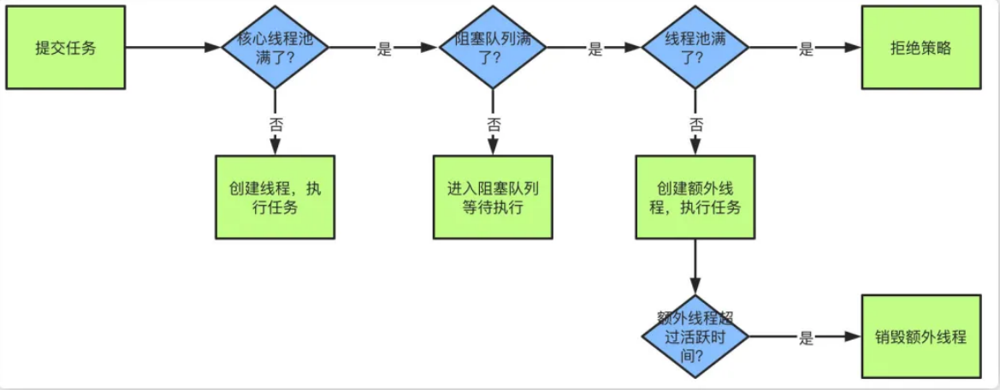

# 创建线程的几种方式

1. 继承Thread类：重写run()方法，调用start()方法启动线程。

   ```java
   public class ThreadTest extends Thread {
       
       @Override
       public void run() {
           System.out.println("重写run()方法");
       }
       
       public static void main(String[] args) {
           ThreadTest thread = new ThreadTest();
           thread.start();
       }
   }
   ```

   ```java
   public class ThreadTest {
       
       public static void main(String[] args) {
           new Thread(() -> {
               System.out.println("重写run()方法");
           }).start();
       }
   }
   ```

2. 实现Runnable接口：重写run()方法，然后将Runnable的对象实例交给Thread的构造器，由Thread调用start()方法启动线程。

   ```java
   public class ThreadTest implements Runnable {
   
       public static void main(String[] args) {
           ThreadTest runnable = new ThreadTest();
           Thread thread = new Thread(runnable);
           thread.start();
       }
   
       @Override
       public void run() {
           System.out.println("重写run()方法");
       }
   }
   ```

3. 实现Callable接口：重写call()方法，将Callable对象实例交给FutureTask的构造器，再将FutureTask对象实例交给Thread的构造器，由Thread调用start()方法启动线程。

   ```java
   public class ThreadTest implements Callable<String> {
   
       public static void main(String[] args) throws ExecutionException, InterruptedException {
           ThreadTest callableThread = new ThreadTest();
           FutureTask<String> futureTask = new FutureTask<>(callableThread);
           Thread thread = new Thread(futureTask);
           thread.start();
           // get()在线程运行完成并获取到结果之前会一直阻塞
           // get()获取到call()的返回值
           String string = futureTask.get();
           // 这里就会输出hello world
           System.out.println(string);
       }
   
       @Override
       public String call() throws Exception {
           System.out.println("call()方法");
           return "hello world";
       }
   }
   ```

4. 线程池：==暂不演示。

总结：

继承Thread类的方式编码和使用都更简单快捷，但是由于Java是单继承的机制，一旦继承了Thread类就不能再继承其他类。

实现Runnable接口或者Callable接口的方式可以避免单继承的问题，而且这种方式下，多个线程可以共享同一个target对象，所以非常适合多个相同线程来处理同一份资源的情况，但是编码相对复杂一些。

Callable接口还可以通过FutureTask的get()方法接收call()方法的返回值，对于需要接收线程执行结果的情况更适合使用。

# Thread类的run方法和start方法的区别

start方法是开启一个新的线程，在新的线程里调用run方法。

直接调用run方法则是在原来的线程里执行run方法，没有开启新的线程。

# Java线程池的核心参数

- 核心线程数corePoolSize
- 最大线程数maximumPoolSize
- 活跃时间keepAliveTime
- 等待队列workQueue
- 拒绝策略RejectedExecutionHandler，一般有四种拒绝策略
  - AbortPolicy：直接丢弃任务，抛出异常，这是**默认策略**
  - CallerRunsPolicy：只用调用者所在的线程来处理任务
  - DiscardOldestPolicy：丢弃等待队列中最旧的任务，并执行当前任务
  - DiscardPolicy：直接丢弃任务，也不抛出异常

# Java线程池工作流程



1. 当我们提交任务，线程池会根据corePoolSize大小创建若干任务数量线程执行任务
2. 当任务的数量超过corePoolSize数量，后续的任务将会进入阻塞队列阻塞排队
3. 当阻塞队列也满了之后，那么将会继续创建(maximumPoolSize-corePoolSize)个数量的线程来 执行任务，如果任务处理完成，maximumPoolSize-corePoolSize额外创建的线程等待 keepAliveTime之后被自动销毁
4. 如果达到maximumPoolSize，阻塞队列还是满的状态，那么将根据不同的拒绝策略对应处理


# sleep()和wait()方法的区别

1. 所属类不同：sleep()方法是属于Thread类的，wait()方法是Object类的方法。
2. 方法类型不同：sleep()方法是静态方法，wait()方法是实例方法。
3. 使用方式不同：sleep()方法可以在任意地方使用Thread.sleep(long millions)来执行；wait()方法则要求对象必须先拿到锁才能执行，否则会抛出java.lang.IllegalMonitorStateException异常。
4. 唤醒方式不同：sleep()方法必须要传入一个时间，该线程会在指定的时间内暂停执行，让出CPU给其他线程，但是依然保持监控状态，当指定的时间到了又会自动恢复运行状态。而wait()方法可以传入一个时间，也可以不传任何参数，如果传入时间也可以在指定时间到了后自动恢复运行，如果没有传入时间则只能通过notify()或者notifyAll()方法唤醒。
5. 释放锁资源不同：在调用sleep()方法的过程中，线程不会释放对象锁。wait()方法会让线程会放弃对象锁，进入等待此对象的等待锁定池，只有针对此对象调用 notify()方法后本线程才进入对象锁定池准备，获取对象锁进入运行状态。
6. 线程状态不同：sleep()方法会让线程进入TIMED_WAITING状态；wait()如果有时间参数也会进入TIMED_WAITING状态，没有时间参数则会进入WAITING状态。

# 线程有哪些状态

1. NEW：当一个Thread对象被new出来后，但是还没有调用start方法的时候。

   ```java
   public class ThreadTest {
       public static void main(String[] args) {
           Thread thread = new Thread();
           // 这里的输出结果就会是NEW
           System.out.println(thread.getState());
       }
   }
   ```

2. RUNNABLE：当一个Thread对象被调用start方法后，就会进入RUNNABLE状态。此时线程并未真正执行，需要和其他线程竞争CPU资源，当该线程竞争到了CPU资源，才会真正执行。

   ```java
   public class ThreadTest {
       public static void main(String[] args) {
           Thread thread = new Thread();
           thread.start();
           // 这里的输出结果就会是RUNNABLE
           System.out.println(thread.getState());
       }
   }
   ```

3. BLOCKED：线程被阻塞，如果它正在等待监视器锁，即在其他线程持有锁的情况下，它将无法执行，直到获取锁。

   ```java
   public class ThreadTest {
       public static void main(String[] args) {
           Object lock = new Object();
           Thread thread1 = new Thread(() -> {
               synchronized (lock) {
                   try {
                       Thread.sleep(2000);
                   } catch (InterruptedException e) {
                       e.printStackTrace();
                   }
               }
           });
           Thread thread2 = new Thread(() -> {
               synchronized (lock) {
               }
           });
   
           thread1.start();
           thread2.start();
           // thread1当前的状态是RUNNABLE
           System.out.println("thread1当前的状态是"+thread1.getState());
           // thread2当前的状态是BLOCKED
           System.out.println("thread2当前的状态是"+thread2.getState());
       }
   }
   ```

4. WAITING：无期限等待，处于这种状态的线程不会被CPU分配资源，需要被其他线程显式的唤醒才能继续执行。

   ```java
   public class ThreadTest {
       public static void main(String[] args) throws InterruptedException {
           Object o = new Object();
           Thread currentThread = Thread.currentThread();
           new Thread(() -> {
               synchronized (o) {
                   // 这里的输出结果就会是WAITING
                   System.out.println(currentThread.getState());
               }
           }).start();
           synchronized (o) {
               o.wait();
           }
       }
   }
   ```

5. TIMED_WAITING：期限等待，处于这种状态的线程也不会被CPU分配资源，但是它们可以在规定的时间结束后被系统自动唤醒。

   ```java
   public class ThreadTest {
       public static void main(String[] args) throws InterruptedException {
           Object o = new Object();
           Thread currentThread = Thread.currentThread();
           new Thread(() -> {
               synchronized (o) {
                   // 这里的输出结果就会是TIMED_WAITING
                   System.out.println(currentThread.getState());
               }
           }).start();
           synchronized (o) {
               // 注意这里的wait方法传入了一个时间参数
               o.wait(5000);
           }
       }
   }
   ```

   ```java
   public class ThreadTest {
       public static void main(String[] args) throws InterruptedException {
           Object o = new Object();
           Thread currentThread = Thread.currentThread();
           new Thread(() -> {
               synchronized (o) {
                   // 这里的输出结果就会是TIMED_WAITING
                   System.out.println(currentThread.getState());
               }
           }).start();
           // 使用Thread.sleep也可以到达这种状态
           Thread.sleep(5000);
       }
   }
   ```

6. TERMINATED：当线程完成执行或被中断，它就进入死亡状态。

   ```java
   public class ThreadTest {
       public static void main(String[] args) throws InterruptedException {
           Thread thread = new Thread();
           thread.start();
           // 这里休眠的是主线程，也就是main方法所在的线程，而不是上面被new出来的thread
           // 休眠是为了能够让thread执行完成
           Thread.sleep(1000);
           // 这里的输出结果就会是TERMINATED
           System.out.println(thread.getState());
       }
   }
   ```

# notify()和notifyAll()方法的区别

